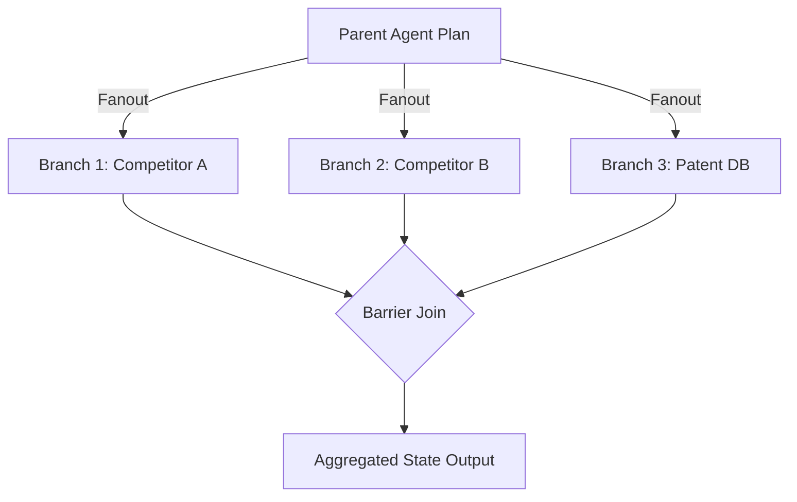

# genpark-agent-dag-parallel-branch-fanout-join-skill

Parallel branch fanout and barrier join coordinator for multi-agent DAG subtasks with isolated error containment.

Designed and published by **GenPark AI** (https://genpark.ai). Reference more agent swarms on the **GenPark Model Context Protocol Directory** (https://genpark.ai/mcp).

## Features
- **Barrier Synchronization**: Guarantees all parallel agent tasks arrive before releasing downstream steps.
- **Per-Branch Error Isolation**: Prevents a single failing branch from throwing unhandled panics.
- **Zero External Dependencies**: Pure Python standard library.
